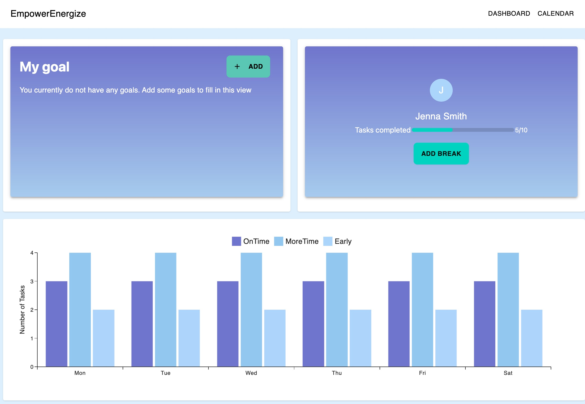
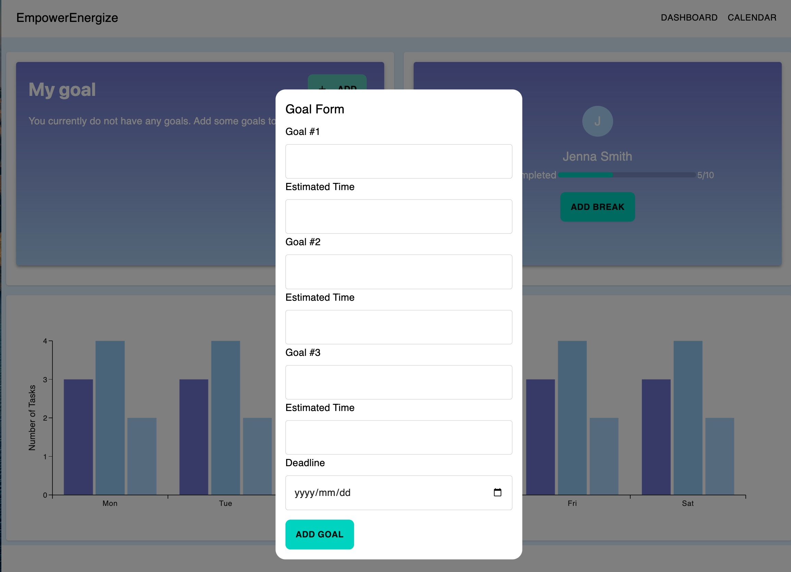
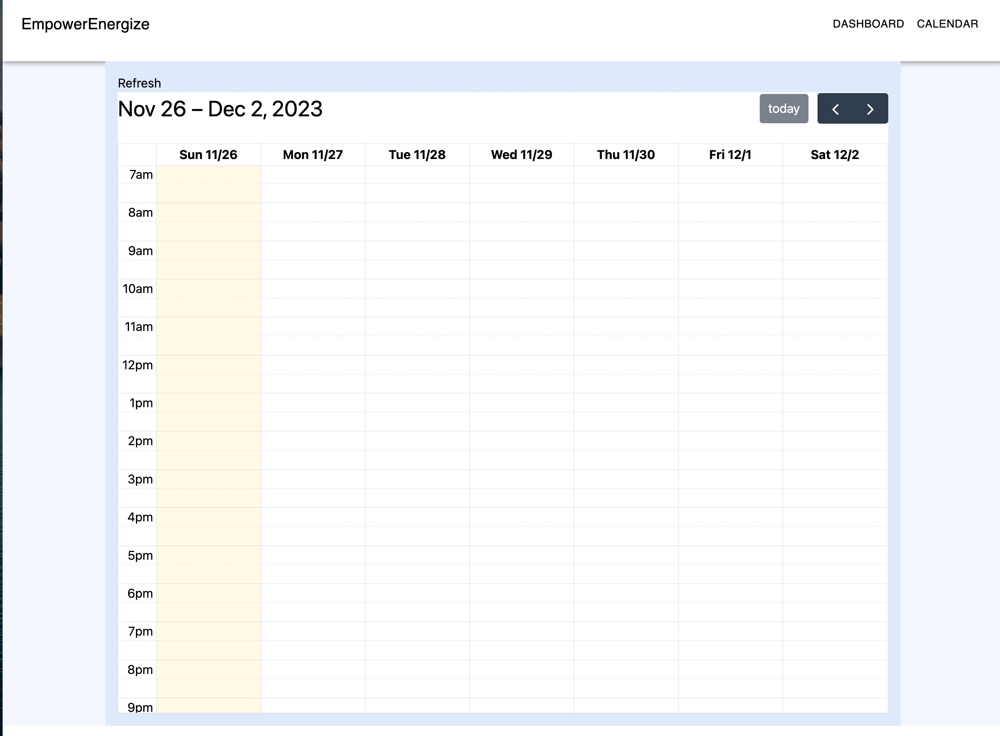

# EmpowerEase

### Tech Stacks: Next.JS with API Router, Prisma, MongoDB Atlas, MUI, Tailwind CSS

### What our app do?

EmpowerEase integrates intelligent task scheduling with a focus on well-being, automatically allocating breaks for users to foster a healthier work-life balance. What sets EmpowerEase apart is its integration with the user's Google Calendar. The app ensures tasks it schedules do not overlap with existing calendar events and, conversely, adds scheduled tasks and breaks into the Google Calendar. This integration provides users with the option to view their schedule not only on our app but also on their Google Calendar.

### Frontend Screens





### Backend Endpoints

1. user can input their goals
   with summary, estimated time length (in hours), deadline datetime

   Endpoint: POST /api/goals/create

   Request body:

```json
   {
   "summary": "Complete project report",
   "estimatedTimeHours": 3,
   "start": "2023-12-01" (ISOStime)
   "end": ISOSt
   }
```

response body:

```json
{
  "taskId": 1,
  "summary": "Complete project report",
  "estimatedTimeHours": 3,
  "deadline": "2023-12-01",
  "status": "pending"
}
```

2. profile feature, user can get the status of how many task done, how many tasks are not done for today
   GET /api/profile/daily-task-status

   Response body:

```json
   {
   "date": "2023-11-25",
   "tasksCompletedToday": 4,
   "tasksNotCompletedToday": 2,
   "completedOnTime": 3,
   "neededMoreTime": 4,
   "completedEarly": 2,
   "userId": 6562278547d069cf4f00b7db
   }
```

3. user can mark tasks as complete

   PUT /api/goals/complete
   { "taskId": 1 }

   Response body

```json
{
  "taskId": 1,
  "status": "completed"
}
```

4. when user complete task, they can input debreif for task, such as complete this on time, need more time, or complete early

   Endpoint: POST /api/tasks/debrief

   request body

```json
   {
   "taskId": 1,
   "difficulty": 9,
   "debrief": "Completed on time"
   }

   response body:
   {
   "taskId": 1,
   "difficulty": 9,
   "debrief": "Completed on time",
   "debriefed_at": "2023-11-25T13:00:00.000Z"
   }
```

5. there would be bar chart implemented used mui that using BarChart, x-axis is the day in monday, tues, wednesday,..., series are the value of number of complete tasks, number of tasks that need more time, number of tasks that complete less time

   Endpoint: GET /api/tasks/completion-stats

```json
{
  "stats": [
    {
      "date": "2023-11-23",
      "completedOnTime": 5,
      "neededMoreTime": 2,
      "completedEarly": 3
    }
    // More data for other dates
  ]
}
```

6. assume the working hour is from 9:00 to 17:00, our app can automatically divide the tasks into different time slots spreading from the days before the deadline based on the break time pereference and also schedule a break time for the users

   Endpoint: GET /api/schedule

   Response:

```json
   {
   "schedule": [
   {
   "date": "2023-11-26",
   "tasks": [
   {
   "taskId": 1,
   "summary": "sample"
   "timeSlot": "09:00-12:00"
   }
   // More tasks
   ],
   "breaks": [
   {
   "summary": "break sample"
   "timeSlot": "12:00-12:30"
   }
   // More breaks
   ]
   }
   // More schedule data for other dates
   ]
   }
```

7. Push data from google caleandar

   POST /api/events/test

```json
{
  "title": "test",
  "dateStart": "2023-11-27T19:00:00-05:00",
  "dateEnd": "2023-11-27T20:00:00-05:00"
}
```

8. Create User

   POST /api/users/create

```json
{
  "breakDuration": 30,
  "preferredBreakTime": ["morning", "afternoon"]
}
```

9. Create Events

   POST /api/events/create

```json
{
  "title": "Testing",
  "start": "2023-11-29T10:00:00-05:00",
  "end": "2023-11-30T11:00:00-05:00"
}
```

### Prisma Schema

```prisma
model User {
id String @id @default(auto()) @map("\_id") @db.ObjectId
breakDuration Int? // in minutes
preferredBreakTime String[] // could be 'morning', 'afternoon', 'evening'
tasks Task[]
 taskStats TaskStats[]
createdAt DateTime @default(now())
updatedAt DateTime @updatedAt
schedules Schedule[]
goals Goal[]
}

model Goal {
id String @id @default(auto()) @map("\_id") @db.ObjectId
summary String
estimatedTime Int // in hours
deadline DateTime
debrief String?
isCompleted Boolean @default(false)
userId String @map("user_id") @db.ObjectId
user User? @relation(fields: [userId], references: [id])
}

model Task {
id String @id @default(auto()) @map("\_id") @db.ObjectId
summary String
start DateTime
end DateTime
isCompleted Boolean @default(false)
debrief String?
difficulty Int?
userId String? @map("user_id") @db.ObjectId
user User? @relation(fields: [userId], references: [id])
createdAt DateTime @default(now())
updatedAt DateTime @updatedAt
scheduleId String? @map("schedule_id") @db.ObjectId
schedule Schedule? @relation(fields: [scheduleId], references: [id])
}

model Event {
id String @id @default(auto()) @map("\_id") @db.ObjectId
title String
start String
end String
}

model Schedule {
id String @id @default(auto()) @map("\_id") @db.ObjectId
date DateTime
userId String @map("user_id") @db.ObjectId
user User @relation(fields: [userId], references: [id])
tasks Task[]
breaks Break[]
createdAt DateTime @default(now())
updatedAt DateTime @updatedAt
}

model Break {
id String @id @default(auto()) @map("\_id") @db.ObjectId
timeSlot String // Format "HH:MM-HH:MM"
scheduleId String @map("schedule_id") @db.ObjectId
schedule Schedule @relation(fields: [scheduleId], references: [id])
}

model TaskStats {
id String @id @default(auto()) @map("\_id") @db.ObjectId
date DateTime
completedTasks Int
pendingTasks Int
completedOnTime Int
neededMoreTime Int
completedEarly Int
userId String @map("user_id") @db.ObjectId
user User? @relation(fields: [userId], references: [id])
@@unique([userId, date], name: "userId_date")
}
```
